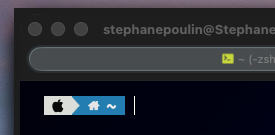
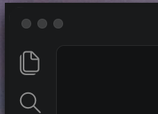
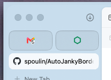
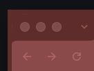
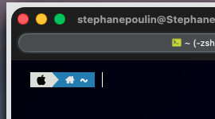
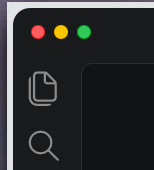
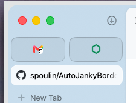
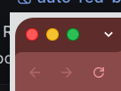

# AutoJankyBorders


*AutoJankyBorders* is a community fork of
[JankyBorders](https://github.com/FelixKratz/JankyBorders) by Felix Kratz. It
adds automatic per-window border colors sampled from window headers, along
with an inverse-color mode. This fork is not affiliated with or maintained by
the original JankyBorders project.

Like the original project, AutoJankyBorders is a lightweight macOS utility for
drawing borders around user windows. The original behavior and static color
options remain available.

## Fork features

- `color=auto` selects a dominant color from each window's header.
- `color=inverse` uses the inverse of the detected header color.
- Colors are cached per window so resizing remains responsive.
- `default_color=0xAARRGGBB` provides a configurable capture fallback.
- Existing per-window settings through `apply-to=<window-id>` are preserved.

### Auto mode examples

These examples use `color=auto`. Each border follows the dominant color in
that window's header, from very dark interfaces to light and themed windows.

| Terminal | Dark window |
| --- | --- |
|  |  |

| Light browser | Red browser theme |
| --- | --- |
|  |  |

### Inverse mode examples

These examples use `color=inverse` on the same kinds of windows. The sampled
header color is inverted while its alpha is preserved.

| Terminal | Dark window |
| --- | --- |
|  |  |

| Light browser | Red browser theme |
| --- | --- |
|  |  |

## Usage

### Build this fork

```bash
git clone https://github.com/spoulin/AutoJankyBorders.git
cd AutoJankyBorders
make
./bin/borders color=auto default_color=0xffe1e3e4
```

Automatic modes require Screen Recording permission in **System Settings →
Privacy & Security → Screen & System Audio Recording**. When permission or
window capture is unavailable, `default_color` is used.

### About the Homebrew version

The official Homebrew formula installs upstream JankyBorders and does not
include this fork's automatic modes:

```bash
brew tap FelixKratz/formulae
brew install borders
```

Run `./bin/borders` directly after building this fork, or replace the Homebrew
link locally if you specifically want the `borders` command to use this build.

### Install and run with Homebrew services

This repository includes a HEAD-only local formula. Because AutoJankyBorders
and upstream JankyBorders both install a command named `borders`, uninstall or
unlink the upstream formula first:

```bash
brew services stop borders 2>/dev/null || true
brew uninstall borders
brew install --HEAD ./Formula/autojankyborders.rb
```

Create `~/.config/borders/bordersrc` with the desired mode:

```bash
#!/bin/bash

options=(
  style=square
  width=5.0
  hidpi=on
  color=auto
  default_color=0xff333333
  order=above
)

borders "${options[@]}"
```

Make the configuration executable, then launch the installed binary once in
the foreground so macOS can request Screen Recording permission:

```bash
chmod +x ~/.config/borders/bordersrc
$(brew --prefix autojankyborders)/bin/borders color=auto
```

After granting permission, stop the foreground process and start the service:

```bash
brew services start autojankyborders
brew services info autojankyborders
```

The service starts at login and reads the same `bordersrc`. Logs are written to
`$(brew --prefix)/var/log/autojankyborders.log`. To stop or remove it:

```bash
brew services stop autojankyborders
brew uninstall autojankyborders
```

This formula tracks the `main` branch because the fork does not yet publish
versioned releases. Reinstall it to pick up newer commits:

```bash
brew reinstall --HEAD autojankyborders
```

### Configuring the appearance
You can configure the appearance directly when starting the `borders` process
or use a configuration file. The appearance can be adapted at any point in
time.

#### Using a configuration file (Optional)
If the primary `borders` process is started without any arguments, it will
search for a file at
`~/.config/borders/bordersrc` and execute it on launch if found.

An example configuration file could look like this:
`~/.config/borders/bordersrc`
```bash
#!/bin/bash

options=(
	style=round
	width=6.0
	hidpi=off
	active_color=0xffe2e2e3
	inactive_color=0xff414550
)

borders "${options[@]}"
```

#### Automatic per-window colors

Use `color=auto` to sample a narrow band in each window's header. Each window
keeps its own sampled color. If macOS does not allow the capture (for
example, before Screen Recording permission is granted), `default_color` is
used instead:
```bash
borders color=auto default_color=0xffe1e3e4 width=5.0
```

The alpha component of `default_color` is also applied to successfully sampled
colors. Passing `color=0xAARRGGBB`, `active_color=...`, or `inactive_color=...`
switches automatic color back off.

Use `color=inverse` to sample the same per-window header color and invert its
RGB components. For example, black becomes white while the configured alpha
is preserved. `default_color` remains unchanged when capture fails.

##### Example: automatic header color

```bash
#!/bin/bash

options=(
  style=square
  width=5.0
  hidpi=on
  color=auto
  default_color=0xff333333
  order=above
)

borders "${options[@]}"
```

Each window receives the dominant color detected in its own header. The dark
gray `default_color` is used only when capture is unavailable.

##### Example: inverse header color

```bash
#!/bin/bash

options=(
  style=square
  width=5.0
  hidpi=on
  color=inverse
  default_color=0xff333333
  order=above
)

borders "${options[@]}"
```

This uses the same header sampling but inverts the detected RGB value: black
becomes white, red becomes cyan, green becomes magenta, and blue becomes
yellow. The alpha channel is preserved.

#### Updating the border properties during runtime
If a `borders` process is already running, invoking a new `borders` instance
with any combination of the available options will update the properties of
the already running instance.

## Documentation

The updated local manual sources are in `docs/`. The upstream manual is
available in the
[JankyBorders Wiki](https://github.com/FelixKratz/JankyBorders/wiki/Man-Page),
but it does not document this fork's automatic modes.

## License and attribution

AutoJankyBorders remains licensed under the GNU General Public License v3.0,
as required by the original project. See [LICENSE](LICENSE). Copyright and
credit for the original JankyBorders implementation remain with its original
authors; subsequent changes are maintained in this fork's Git history.
