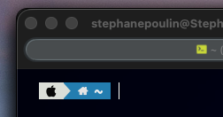
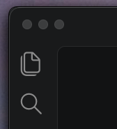
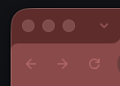

# AutoJankyBorders


*AutoJankyBorders* is a community fork of
[JankyBorders](https://github.com/FelixKratz/JankyBorders) by Felix Kratz. It
adds automatic per-window border colors sampled from window headers, along
with an inverse-color mode. This fork is not affiliated with or maintained by
the original JankyBorders project.

Like the original project, AutoJankyBorders is a lightweight macOS utility for
drawing borders around user windows. The original behavior and static color
options remain available.

## Why this?

Not everyone enjoys the rounded-window aesthetic of macOS, especially when
corner radii and window treatments vary from one application to another. For
people who are particular about UI consistency, those small differences can
be surprisingly distracting.

JankyBorders already provides a lightweight way to bring a consistent outline
to macOS windows. AutoJankyBorders builds on that idea by pairing the border
with the most harmonious color it can derive for each individual window. It
samples the window header, keeps the result specific to that window, and can
either match the detected color or use its inverse. Combined with square
borders, this creates a more deliberate and visually consistent desktop
without requiring every application to follow the same design language.

## Fork features

- `color=auto` selects a dominant color from each window's header.
- `color=inverse` uses the inverse of the detected header color.
- `color=auto-gradient` blends colors sampled near all four window corners.
- `color=inverse-gradient` applies the same four-corner blend after inversion.
- Colors are cached per window so resizing remains responsive.
- `default_color=0xAARRGGBB` provides a configurable capture fallback.
- Existing per-window settings through `apply-to=<window-id>` are preserved.

### Before and after

`color=auto` follows the dominant header color. `color=inverse` samples the
same header and inverts its RGB value while preserving alpha.

#### Terminal

| Before | Auto | Inverse |
| --- | --- | --- |
|  |  |  |

#### Dark window

| Before | Auto | Inverse |
| --- | --- | --- |
|  |  |  |

#### Light browser

| Before | Auto | Inverse |
| --- | --- | --- |
|  |  |  |

#### Red browser theme

| Before | Auto | Inverse |
| --- | --- | --- |
|  |  |  |

## Usage

### Build this fork

```bash
git clone https://github.com/spoulin/AutoJankyBorders.git
cd AutoJankyBorders
make
./bin/borders color=auto default_color=0xffe1e3e4
```

Automatic modes require Screen Recording permission in **System Settings →
Privacy & Security → Screen & System Audio Recording**. When permission or
window capture is unavailable, `default_color` is used.

#### Why Screen Recording permission is required

macOS protects APIs that capture the contents of other applications' windows.
AutoJankyBorders needs this permission for `color=auto`, `color=inverse`,
`color=auto-gradient`, and `color=inverse-gradient`. CoreGraphics temporarily
provides an image of each target window in memory. The solid modes examine a
thin horizontal band in its header; the gradient modes examine small regions
near all four corners.

AutoJankyBorders does not save screenshots, write captured pixels to disk, or
send them over the network. The temporary image and pixel buffer are released
immediately after the color is calculated. Only the resulting RGB color is
cached for that window. Gradient mode caches four RGB colors per window.
Static modes such as `active_color` and
`inactive_color` do not need screen capture.

If permission is denied or later revoked, borders continue to work using
`default_color`. Permission can be reviewed or removed at any time in **System
Settings → Privacy & Security → Screen & System Audio Recording**. Restart the
foreground process or Homebrew service after changing this permission.

If AutoJankyBorders starts before permission is granted, existing windows may
already have `default_color` cached. Granting permission does not retroactively
replace every cached fallback, so stop and relaunch the process afterward:

```bash
pkill borders 2>/dev/null || true
brew services restart autojankyborders
```

A `brew upgrade --fetch-HEAD` rebuild may also produce a new executable for
which macOS requests Screen Recording access again. If all borders suddenly
use `default_color` after an upgrade, launch the installed binary once in the
foreground, grant access, and then restart the service.

### About the Homebrew version

The official Homebrew formula installs upstream JankyBorders and does not
include this fork's automatic modes:

```bash
brew tap FelixKratz/formulae
brew install borders
```

Run `./bin/borders` directly after building this fork, or replace the Homebrew
link locally if you specifically want the `borders` command to use this build.

### Install and run with Homebrew services

This repository includes a HEAD-only formula and can be used as a custom tap.
Because AutoJankyBorders and upstream JankyBorders both install a command named
`borders`, trust and uninstall the upstream formula first, then add this
repository as an explicitly named tap:

```bash
brew trust felixkratz/formulae
brew services stop borders 2>/dev/null || true
brew uninstall borders
brew tap spoulin/autojankyborders https://github.com/spoulin/AutoJankyBorders.git
brew trust spoulin/autojankyborders
brew install --HEAD spoulin/autojankyborders/autojankyborders
```

Create `~/.config/borders/bordersrc` with the desired mode:

```bash
#!/bin/bash

options=(
  style=square
  width=5.0
  hidpi=on
  color=auto-gradient
  default_color=0xff333333
  order=above
)

/opt/homebrew/opt/autojankyborders/bin/borders "${options[@]}"
```

Make the configuration executable, then launch the installed binary once in
the foreground so macOS can request Screen Recording permission:

```bash
chmod +x ~/.config/borders/bordersrc
$(brew --prefix autojankyborders)/bin/borders color=auto-gradient
```

After granting permission, stop the foreground process and start the service:

```bash
brew services start autojankyborders
brew services info autojankyborders
```

The service starts at login and reads the same `bordersrc`. Logs are written to
`$(brew --prefix)/var/log/autojankyborders.log`. To stop or remove it:

```bash
brew services stop autojankyborders
brew uninstall autojankyborders
```

If the borders remain gray, round, and static, the service is running with its
defaults and did not apply `bordersrc`. Check the log:

```bash
tail -f "$(brew --prefix)/var/log/autojankyborders.log"
```

An error such as `borders: command not found` means the configuration should
invoke the installed binary by its absolute path, as shown above. On Intel
Macs, replace `/opt/homebrew` with `/usr/local`. Restart after changing the
configuration:

```bash
brew services restart autojankyborders
brew services info autojankyborders
```

`Running: true` and `Loaded: true` confirm that the service is active and
registered to start when the user logs in. `Schedulable: false` is expected for
this persistent service.

This formula tracks the `main` branch because the fork does not yet publish
versioned releases. Ask Homebrew to fetch HEAD when checking for newer commits:

```bash
brew services stop autojankyborders
brew upgrade --fetch-HEAD autojankyborders
brew services start autojankyborders
```

### Configuring the appearance
You can configure the appearance directly when starting the `borders` process
or use a configuration file. The appearance can be adapted at any point in
time.

#### Using a configuration file (Optional)
If the primary `borders` process is started without any arguments, it will
search for a file at
`~/.config/borders/bordersrc` and execute it on launch if found.

An example configuration file could look like this:
`~/.config/borders/bordersrc`
```bash
#!/bin/bash

options=(
	style=round
	width=6.0
	hidpi=off
	active_color=0xffe2e2e3
	inactive_color=0xff414550
)

borders "${options[@]}"
```

#### Automatic per-window colors

Use `color=auto` to sample a narrow band in each window's header. Each window
keeps its own sampled color. If macOS does not allow the capture (for
example, before Screen Recording permission is granted), `default_color` is
used instead:
```bash
borders color=auto default_color=0xffe1e3e4 width=5.0
```

The alpha component of `default_color` is also applied to successfully sampled
colors. Passing `color=0xAARRGGBB`, `active_color=...`, or `inactive_color=...`
switches automatic color back off.

Use `color=inverse` to sample the same per-window header color and invert its
RGB components. For example, black becomes white while the configured alpha
is preserved. `default_color` remains unchanged when capture fails.

Use `color=auto-gradient` to sample four independent colors near the window
corners. The border uses a bilinear blend: left to right horizontally and top
to bottom vertically, with continuous transitions at the corners. The related
`color=inverse-gradient` mode inverts all four sampled colors before blending.

```bash
borders style=square width=5.0 hidpi=on \
  color=auto-gradient color_refresh=1000 \
  color_transition=300 color_threshold=6 \
  default_color=0xff333333 order=above
```

Set `color_refresh` to periodically resample only the focused window. The
value is expressed in milliseconds; `1000` is the recommended starting point.
Use `color_refresh=0` (the default) to disable it. Values below 250 ms are
rejected to avoid excessive full-window captures. Refreshing pauses briefly
while a window is being moved or resized.

Set `color_transition` to morph smoothly from the displayed color to a newly
sampled color without taking additional screenshots during the animation.
`color_threshold` ignores small per-channel differences caused by capture
noise. A responsive starting point is:

```bash
color_refresh=1000
color_transition=300
color_threshold=6
```

Use `color_transition=0` to keep immediate color changes.

##### Example: automatic four-corner gradient

```bash
#!/bin/bash

options=(
  style=square
  width=5.0
  hidpi=on
  color=auto-gradient
  color_refresh=1000
  color_transition=300
  color_threshold=6
  default_color=0xff333333
  order=above
)

borders "${options[@]}"
```

Each corner keeps its own sampled color. If capture fails, all four corners
use `default_color`, producing a solid fallback rather than a partial gradient.

##### Example: automatic header color

```bash
#!/bin/bash

options=(
  style=square
  width=5.0
  hidpi=on
  color=auto
  default_color=0xff333333
  order=above
)

borders "${options[@]}"
```

Each window receives the dominant color detected in its own header. The dark
gray `default_color` is used only when capture is unavailable.

##### Example: inverse header color

```bash
#!/bin/bash

options=(
  style=square
  width=5.0
  hidpi=on
  color=inverse
  default_color=0xff333333
  order=above
)

borders "${options[@]}"
```

This uses the same header sampling but inverts the detected RGB value: black
becomes white, red becomes cyan, green becomes magenta, and blue becomes
yellow. The alpha channel is preserved.

#### Updating the border properties during runtime
If a `borders` process is already running, invoking a new `borders` instance
with any combination of the available options will update the properties of
the already running instance.

## Documentation

The updated local manual sources are in `docs/`. The upstream manual is
available in the
[JankyBorders Wiki](https://github.com/FelixKratz/JankyBorders/wiki/Man-Page),
but it does not document this fork's automatic modes.

## License and attribution

AutoJankyBorders remains licensed under the GNU General Public License v3.0,
as required by the original project. See [LICENSE](LICENSE). Copyright and
credit for the original JankyBorders implementation remain with its original
authors; subsequent changes are maintained in this fork's Git history.
